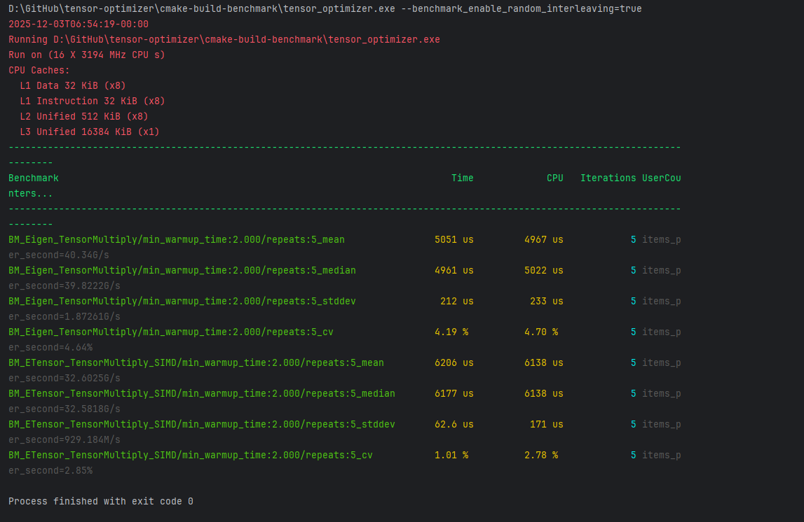
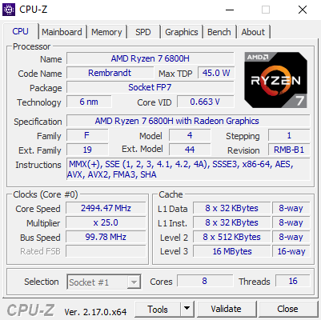

# tensor-optimizer-experimental-library

An experimental tensor library which will eventually replace or complement the one in the FLUX GitHub repository. This repository is primarily used for benchmarking highly optimized floating point operations and can be extended for use in other applications involving tensor mathematics, such as AI and graphics processing.
If you are wondering what this library does, it is related to one of my projects named FLUX, which is basically a full machine learning framework like PyTorch or TensorFlow, but educational in scope. Previously, it used a naive O(n³) time complexity algorithm for matrix multiplications, but I am now working to develop a better GEMM implementation that properly leverages hardware capabilities and CPU caching mechanisms to improve performance.
This has led me to develop this experimental tensor library, which will eventually be an option for use in the FLUX framework. As of now, FLUX supports MLP, CNN, and transformer model pre-training and inference. It is still under active development.

ETensor is a custom implementation of the native tensor library used in FLUX, and the goal is simply extreme optimization such that it matches or comes close to Eigen's default performance. This has led to extensive research on loop unrolling, CPU intrinsics using SIMD instructions, and caching mechanics, all of which will be discussed here.
Right now, the code has achieved remarkable speed compared to Eigen's default implementation using Google Benchmark, and I am trying to optimize it even further. The code uses SIMD with AVX2 instructions, which my CPU supports. As can be seen from the benchmarks, the speed is around 83.7% of Eigen's speed for a 100×100×100 tensor multiplication. The performance gap is even smaller when the tensor sizes are reduced.






````
// Horizontal sum helper
inline float hsum256_ps_avx(__m256 v) {
    __m128 vlow  = _mm256_castps256_ps128(v);
    __m128 vhigh = _mm256_extractf128_ps(v, 1);
    vlow = _mm_add_ps(vlow, vhigh);
    vlow = _mm_hadd_ps(vlow, vlow);
    vlow = _mm_hadd_ps(vlow, vlow);
    return _mm_cvtss_f32(vlow);
}

void Tensor_Multiply_Tensor_SIMD(ETensor& result,
                                          const ETensor& first,
                                          const ETensor& second) {
    // Shapes:
    // first  (A): M x K x D
    // second (B): K x N x D
    // result (C): M x N x D

    const int M = first.rows();
    const int K = first.columns();
    const int D = first.depth();
    const int N = second.columns();

    const float* A_data = first.Get_Data();
    const float* B_data = second.Get_Data();
    float* C_data = result.Get_Data();

    const int strideA = M * K;
    const int strideB = K * N;
    const int strideC = M * N;

#if defined(__AVX2__)

    // ============================================================
    // STEP 1: Allocate buffer for transposed B (N x K per depth)
    // ============================================================
    std::vector<float> B_transposed(N * K);

    for (int d = 0; d < D; ++d) {
        const float* Ad = A_data + d * strideA;
        const float* Bd = B_data + d * strideB;
        float* Cd = C_data + d * strideC;

        // ============================================================
        // STEP 2: Transpose B (K x N) -> B_transposed (N x K)
        // This has strided READS but sequential WRITES
        // ============================================================
        for (int n = 0; n < N; ++n) {
            for (int k = 0; k < K; ++k) {
                // Read: strided (jumping by N each k)
                // Write: sequential (n * K + k is contiguous for fixed n)
                B_transposed[n * K + k] = Bd[k * N + n];
            }
        }

        // ============================================================
        // STEP 3: Sequential access on B_transposed
        // ============================================================
        const float* B_trans_ptr = B_transposed.data();

        for (int i = 0; i < M; ++i) {
            const float* row_A = Ad + i * K;

            int j = 0;
            // Unrolled loop: Process 4 rows of B_transposed at once
            for (; j <= N - 4; j += 4) {
                const float* row_B0 = B_trans_ptr + (j + 0) * K;
                const float* row_B1 = B_trans_ptr + (j + 1) * K;
                const float* row_B2 = B_trans_ptr + (j + 2) * K;
                const float* row_B3 = B_trans_ptr + (j + 3) * K;

                __m256 sum0 = _mm256_setzero_ps();
                __m256 sum1 = _mm256_setzero_ps();
                __m256 sum2 = _mm256_setzero_ps();
                __m256 sum3 = _mm256_setzero_ps();

                int k = 0;
                for (; k <= K - 8; k += 8) {
                    __m256 va = _mm256_loadu_ps(row_A + k);

                    __m256 vb0 = _mm256_loadu_ps(row_B0 + k);
                    __m256 vb1 = _mm256_loadu_ps(row_B1 + k);
                    __m256 vb2 = _mm256_loadu_ps(row_B2 + k);
                    __m256 vb3 = _mm256_loadu_ps(row_B3 + k);

                    sum0 = _mm256_fmadd_ps(va, vb0, sum0);
                    sum1 = _mm256_fmadd_ps(va, vb1, sum1);
                    sum2 = _mm256_fmadd_ps(va, vb2, sum2);
                    sum3 = _mm256_fmadd_ps(va, vb3, sum3);
                }

                float val0 = hsum256_ps_avx(sum0);
                float val1 = hsum256_ps_avx(sum1);
                float val2 = hsum256_ps_avx(sum2);
                float val3 = hsum256_ps_avx(sum3);

                for (; k < K; ++k) {
                    float a_val = row_A[k];
                    val0 += a_val * row_B0[k];
                    val1 += a_val * row_B1[k];
                    val2 += a_val * row_B2[k];
                    val3 += a_val * row_B3[k];
                }

                Cd[i * N + (j + 0)] = val0;
                Cd[i * N + (j + 1)] = val1;
                Cd[i * N + (j + 2)] = val2;
                Cd[i * N + (j + 3)] = val3;
            }

            // Cleanup remaining columns
            for (; j < N; ++j) {
                const float* row_B = B_trans_ptr + j * K;
                __m256 sum = _mm256_setzero_ps();
                int k = 0;
                for (; k <= K - 8; k += 8) {
                    sum = _mm256_fmadd_ps(_mm256_loadu_ps(row_A + k),
                                          _mm256_loadu_ps(row_B + k), sum);
                }
                float val = hsum256_ps_avx(sum);
                for (; k < K; ++k) val += row_A[k] * row_B[k];
                Cd[i * N + j] = val;
            }
        }
    }

#else
    // Scalar fallback (same as before)
    for (int d = 0; d < D; ++d) {
        const float* Ad = A_data + d * strideA;
        const float* Bd = B_data + d * strideB;
        float* Cd = C_data + d * strideC;

        for (int i = 0; i < M; ++i) {
            for (int j = 0; j < N; ++j) {
                float sum = 0.0f;
                for (int k = 0; k < K; ++k) {
                    sum += Ad[i * K + k] * Bd[k * N + j];
                }
                Cd[i * N + j] = sum;
            }
        }
    }
#endif
}
````


## The Alignment Problem

The standard std::vector<float> allocator provides alignment guarantees only for the type itself, which for float is typically 4 bytes. When we allocate std::vector<float> B_transposed(N * K), the underlying memory address returned by the default allocator is guaranteed to be 4-byte aligned, but it is NOT guaranteed to align to cache line boundaries.
Modern x86-64 processors use 64-byte cache lines, meaning the CPU loads memory in 64-byte chunks. When our data structure starts at an address that is not divisible by 64, several inefficient scenarios emerge.
First, a single row of the transposed matrix may span multiple cache lines even when the row size would theoretically fit within one cache line. Second, when we load data using aligned SIMD instructions like _mm256_load_ps (which requires 32-byte alignment), we either cannot use these faster instructions at all or risk segmentation faults. Third, prefetching becomes less effective because the CPU must fetch multiple cache lines to access what should be contiguous data.

So further development is still ongoing.

